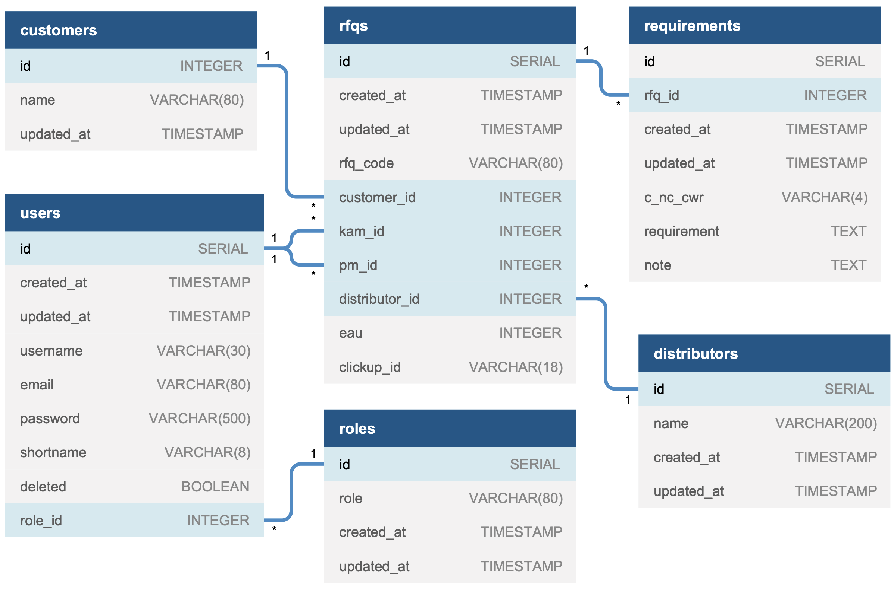

# `Backend` in Node.js & Typescript for **Riverdi RFQ** System

**Notice: This project is a REST API that is ment to work with [frontend GUI](link)**

<hr>

> The sole purpose of this project is to fullfill requirements of **[Riverdi](https://riverdi.com)** stakeholders (Riverdi Sales Department) in terms of creating an application for convienient **RFQ** (_Request For Quotation_) mangement and integrate it with current workflows that are run in [Comarch ERP XL](https://www.comarch.pl/erp/xl/), [ClickUp](https://clickup.com/) and [SharePoint](https://www.microsoft.com/pl-pl/microsoft-365/sharepoint/collaboration).

<hr>

## Main Features

- Add new RFQs
- Generate unique RFQ code (based on specification)
- list RFQs
- sort RFQs (handled on frontend)
- filter RFQs (handled on frontend)
- Add requirements (with notes) to existing RFQs
- All `CRUD` operations on: **RFQs, requirements, distributors and users**
- Comarch ERP XL integration (fetching customers)
- SharePoint Integration (creating specified folder structure, puting files)
- ClickUp Integration (creating tasks, assigning people, fetching task statuses)

## Data Model



## Migrations

In order to tie the database structure to the code (helpful when working with other engineers) I had to use **`schema migrations`** (_code that describes a precise change to make to the database_).

The tool of the choice is [node-pg-migrate](https://github.com/salsita/node-pg-migrate). All migratrons are written in plain SQL.

> What are **`schema migrations`** and how to use **node-pg-migrate** is out of the scope of this document.

## Data Layer Logic

I've created separate layer of utility methods to handle database operations.

They should be used in controller business logic instead of operating directly on database.

---

### User Repo

---

#### Method:

```Javascript
UserRepo.find();
```

#### Response (`Array` of `Objects`):

```Javascript
[{id, username, name, email, shortname, role_id}]
```

> Returns list of all users that are not admins and are not marked as `deleted`.

---

#### Method:

```Javascript
UserRepo.findWithAdmins();
```

#### Response (`Array` of `Objects`):

```Javascript
[{id, username, name, email, shortname, role_id}]
```

> Returns list of all users (admins included) that are not marked as `deleted`.

---

#### Method:

```Javascript
UserRepo.findById(id: string);
```

#### Response (`Object`):

```Javascript
{id, username, email, shortname, role_id}
```

> Returns user with matching `id` (or returns empty object).

---

#### Method:

```Javascript
UserRepo.findByEmail(email: string);
```

#### Response (`Object`):

```Javascript
{id, username, email, password, shortname, role_id, deleted}
```

> Returns user with matching email (or returns empty object). Returned **hashed** password is for login logic purposes.

---

#### Method:

```Javascript
UserRepo.insert({
  username,
  password,
  email,
  shortname,
  role_id,
}: {
  username: string;
  password: string;
  email: string;
  shortname: string;
  role_id: string;
});
```

#### Response (`Object`):

```Javascript
{id, username, email, shortname, role_id}
```

> Inserts new user into database. Shortname and email have to be unique. **Password should be stored in a hashed form!** _(route controller logic should handle that)_

---

#### Method:

```Javascript
UserRepo.updateData({
  id,
  username,
  email,
  shortname,
  role_id,
}: {
  id: string;
  username: string;
  email: string;
  shortname: string;
  role_id: string;
});
```

#### Response (`Object`):

```Javascript
{id, username, email, shortname, role_id}
```

> Updates existing user's data (only username, email, shortname and role_id). Shortname and email have to be unique. ID is immutable. Changing password is handled by dedicated method.

---

#### Method:

```Javascript
UserRepo.updatePassword({
  id,
  password,
}: {
  id: string;
  password: string;
});
```

#### Response (`Object`):

```Javascript
{id, username, email, shortname, role_id}
```

> Updates existing user's password. **Password should be provided in a hashed form!** _(route controller logic should handle that)_

---

#### Method:

```Javascript
UserRepo.delete(id: string);
```

#### Response (`Object`):

```Javascript
{id, username, email, role_id, shortname}
```

> Removes user from database.

---

#### Method:

```Javascript
UserRepo.markDeleted(id: string)
```

#### Response (`Object`):

```Javascript
{id, username, email, role_id, shortname}
```

> Marks user ad "deleted". Disables user (from login, from preforming actions, from appearing on all kings of listings) but keeps all the data (transaction history, etc.)

---

#### Method:

```Javascript
UserRepo.markUndeleted(id: string)
```

#### Response (`Object`):

```Javascript
{id, username, email, role_id, shortname}
```

> Sets "deleted" flag to `false` (enables user).

---

#### Method:

```Javascript
UserRepo.count()
```

#### Response (`Number`):

> Returns number of users.

---

### RFQ Repo

---

#### Method:

```Javascript
RfqRepo.find();
```

#### Response (`Array` of `Objects`):

```Javascript
[{id, rfq_code, eau, customer, distributor, pm, kam, updated}]
```

> Returns list of all rfqs

---

#### Method:

```Javascript
RfqRepo.findById(id: string);
```

#### Response (`Object`):

```Javascript
{
  id,
  rfq_code,
  eau,
  clickup_id,
  customer_id,
  customer,
  distributor_id,
  distributor,
  pm_id,
  pm,
  pm_fullname,
  kam_id,
  kam,
  kam_fullname,
  final_solutions,
  conclusions,
  samples_expected,
  mp_expected,
  eau_max,
  updated
}
```

> Returns RFQ with matching `id`.

---

#### Method:

```Javascript
RfqRepo.findByDistributorId(distributor_id: string)
```

#### Response (`Array` of `Objects`):

```Javascript
[{id, rfq_code}]
```

> Returns list of all rfqs of distributor with matching `distributor_id`.

---

#### Method:

```Javascript
RfqRepo.findByRfqCode(rfq_code: string);
```

#### Response (`Object`):

```Javascript
{id, rfq_code}
```

> Returns RFQ with matching `id`.

---

#### Method:

```Javascript
RfqRepo.insert({
   rfq_code,
    eau,
    customer_id,
    distributor_id,
    pm_id,
    kam_id,
    clickup_id,
    final_solutions,
    conclusions,
    samples_expected,
    mp_expected,
    eau_max,
  }: {
    rfq_code: string;
    eau: string;
    customer_id: string;
    distributor_id: string;
    pm_id: string;
    kam_id: string;
    clickup_id: string;
    final_solutions: string;
    conclusions: string;
    samples_expected: string;
    mp_expected: string;
    eau_max: string;
});
```

#### Response (`Object`):

```Javascript
{id, rfq_code}
```

> Inserts new RFQ into database. `rfq_code` have to be unique.

---

#### Method:

```Javascript
RfqRepo.updateData({
  id,
    eau,
    customer_id,
    distributor_id,
    pm_id,
    kam_id,
    final_solutions,
    conclusions,
    samples_expected,
    mp_expected,
    eau_max,
  }: {
    id: string;
    eau: string;
    customer_id: string;
    distributor_id: string;
    pm_id: string;
    kam_id: string;
    final_solutions: string;
    conclusions: string;
    samples_expected: string;
    mp_expected: string;
    eau_max: string;
});
```

#### Response (`Object`):

```Javascript
{id, rfq_code}
```

> Updates RFQ into database. `rfq_code` have to be unique.

---

#### Method:

```Javascript
RfqRepo.delete(id: string);
```

#### Response (`Object`):

```Javascript
{id, rfq_code}
```

> Removes rfq from database.

---

#### Method:

```Javascript
RfqRepo.count()
```

#### Response (`Number`):

> Returns number of rfqs.

---

### Requirement Repo

---

#### Method:

```Javascript
RequirementRepo.find();
```

#### Response (`Array` of `Objects`):

```Javascript
[{id, rfq_id, priority, c_nc_cwr, requirement, note, date }]
```

> Returns list of all requirements

---

#### Method:

```Javascript
RequirementRepo.findByRfqId(rfq_id: string);
```

#### Response (`Array` of `Objects`):

```Javascript
[{id, rfq_id, priority, c_nc_cwr, requirement, note, date }]
```

> Returns list of all requirements for given `rfq_id`

---

#### Method:

```Javascript
RequirementRepo.findById(id: string);
```

#### Response (`Object`):

```Javascript
{id, rfq_id, priority, c_nc_cwr, requirement, note, date }
```

> Returns requirement with matching `id`

---

#### Method:

```Javascript
RequirementRepo.insert({
    rfq_id,
    priority,
    c_nc_cwr,
    requirement,
    note,
  }: {
    rfq_id: string;
    priority: string;
    c_nc_cwr: string;
    requirement: string;
    note: string;
});
```

#### Response (`Object`):

```Javascript
{id, rfq_id}
```

> Inserts new **requirement** into database.

---

#### Method:

```Javascript
RequirementRepo.updateData({
    id,
    rfq_id,
    priority,
    c_nc_cwr,
    requirement,
    note,
  }: {
    id: string;
    rfq_id: string;
    priority: string;
    c_nc_cwr: string;
    requirement: string;
    note: string;
});
```

#### Response (`Object`):

```Javascript
{id, rfq_id, c_nc_cwr, requirement, note}
```

> Updates **requirement** with given `id` in the database.

---

#### Method:

```Javascript
RequirementRepo.delete(id: string);
```

#### Response (`Object`):

```Javascript
{id}
```

> Removes **requirement** from database.

---

#### Method:

```Javascript
RequirementRepo.count()
```

#### Response (`Number`):

> Returns number of requirements.

---

### Distributor Repo

---

#### Method:

```Javascript
DistributorRepo.find();
```

#### Response (`Array` of `Objects`):

```Javascript
[{id, name }]
```

> Returns list of all distributors

---

#### Method:

```Javascript
DistributorRepo.findById(id: string);
```

#### Response (`Object`):

```Javascript
{id, name }
```

> Returns distributor with matching `id`

---

#### Method:

```Javascript
DistributorRepo.findByName(name: string);
```

#### Response (`Object`):

```Javascript
{id, name }
```

> Returns distributor with matching `name`

---

#### Method:

```Javascript
DistributorRepo.insert({ name }: { name: string });
```

#### Response (`Object`):

```Javascript
{id, name}
```

> Inserts new distributor into database.

---

#### Method:

```Javascript
DistributorRepo.updateData({ id, name }: { id: string; name: string });
```

#### Response (`Object`):

```Javascript
{id, name}
```

> Updates distributor with given `id` in the database.

---

#### Method:

```Javascript
DistributorRepo.delete(id: string);
```

#### Response (`Object`):

```Javascript
{id, name}
```

> Removes distributor from database.

---

#### Method:

```Javascript
DistributorRepo.count()
```

#### Response (`Number`):

> Returns number of distributors.

---

### Customer Repo

---

#### Method:

```Javascript
CustomerRepo.find();
```

#### Response (`Array` of `Objects`):

```Javascript
[{id, name }]
```

> Returns list of all customers

---

#### Method:

```Javascript
CustomerRepo.findById(id: string);
```

#### Response (`Object`):

```Javascript
{id, name }
```

> Returns customer with matching `id`

---

#### Method:

```Javascript
CustomerRepo.count()
```

#### Response (`Number`):

> Returns number of customers.

---

## API (endpoints documentation)

---

### Usage _(note: this is a REST API and it is supposed to be consumed by some kind of frontend)_

---

### 👉 User Router:

---

#### Route (unprotected): `/api/v1/users/login`

> Request: `POST`
>
> Request Body: `{email, password}`
>
> Response: `{ id, username, email, shortname, role_id, deleted }` + `Set-Cookie` with **user** in **`JWT`**

_**Feature:** allows existing user to "log in" - sends back user details in response body, starts cookie session and sends back user in JWT ([JSON Web Token](https://jwt.io/)) stored in a cookie_

---

#### Route (protected): `/api/v1/users/signup`

> Request: `POST`
>
> Request Body: `{ email, password, passwordConfirm, username, shortname, role_id }`
>
> Request Cookie: `currentUser in JWT`
>
> Response: `{ id, username, email, shortname, role_id }`

_**Feature:** create a new user with data provided in the request's body (important! New users can be added only by admins – standard user would get 401 error with message: **"Not authorized"** )_

---

#### Route (unprotected): `/api/v1/users/logout`

> Request: `POST`
>
> Request Body: `{ email, password, passwordConfirm, username, shortname, role_id }`
>
> Response: `{ id, username, email, shortname, role_id }`

_**Feature:** logs out user - clears session_

---

#### Route (protected): `/api/v1/users/:id"`

> Request: `GET`
>
> Request Cookie: `currentUser in JWT`
>
> Response: `{ id, username, email, shortname, role_id }`

_**Feature:** returns user's `id, username, email, shortname, role_id` for given `id`_

---

## Tests

## Screenshots

## How to use it

## How to develop it

git flow

## Future optimalisations

server side sorting + data pagination

## Infrastructure (backend, frontend, database, cookies)

## Security

## Installation

## Configuration

# Project Name

> Abstract of the project or small introduction of what the project is about

<hr>

## Table of Contents

- [Team Members](#team-members)
